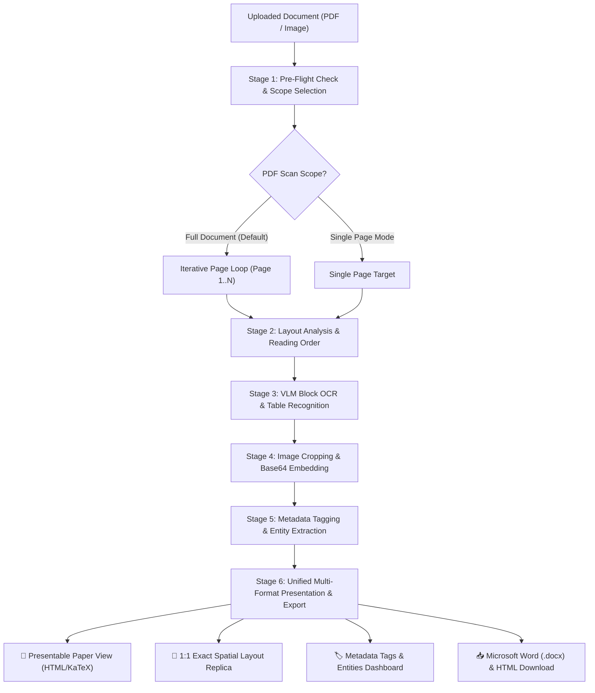

# Tata Power Document Intelligence & OCR Hub
## System Workflow & Technical Architecture Specification

Welcome to the **Tata Power Document Intelligence & OCR Hub**. This document outlines the end-to-end technical workflow, pipeline stages, multi-page processing mechanics, and user interface features.

---

## ⚡ Technical Architecture Overview



---

## 📋 End-to-End Execution Workflow

### Stage 1: Document Upload & Scope Selection
1. **File Input**: The user uploads a PDF or raster image (`PNG`, `JPG`, `WEBP`) via the left sidebar.
2. **Scan Scope Selection**:
   - **🔄 Scan All Pages (Full Document - Default)**: Automatically iterates through all pages sequentially (`Page 1, Page 2, ... Page N`) with a live progress bar.
   - **📄 Single Page Only**: Allows picking a specific page number for rapid single-page analysis.
3. **Pre-Flight Health Check (`ocr_errors`)**: Assesses whether PDF pages contain clean vector text vs corrupt/scanned images.

---

### Stage 2: Page Layout & Reading Order Analysis (`Layout Analysis`)
1. **Bounding Box Detection**: Identifies bounding coordinates `[x0, y0, x1, y1]` for all page elements.
2. **Canonical Label Assignment**: Classifies regions into standard labels:
   - `Title`, `SectionHeader`, `Text`
   - `Table`, `TableOfContents`
   - `Picture`, `Figure`, `Diagram`, `Logo`, `Stamp`, `Photo`
   - `PageHeader`, `PageFooter`
3. **Reading Order Sorting**: Assigns 0-indexed reading position to maintain natural multi-column document flow.

---

### Stage 3: High-Precision VLM Block OCR & Math Typesetting
1. **Block-Level OCR**: Reads bounded text blocks with Surya's native VLM models running locally on Apple Silicon / MacBook hardware.
2. **Math LaTeX Conversion**: Automatically converts `<math>` tags into KaTeX-renderable LaTeX delimiters (`\(` for inline math, `\[` for display equations).
3. **Table Recognition**: Extracts HTML table structures (`<table>`, `<tr>`, `<th>`, `<td>`).

---

### Stage 4: High-Resolution Image Cropping & Base64 Embedding
1. **Visual Region Detection**: Flags visual non-text blocks (`Picture`, `Figure`, `Diagram`, `Logo`, `Stamp`, `Photo`).
2. **High-Res Cropping**: Crops bounding coordinates `(x0-4, y0-4, x1+4, y1+4)` directly from the original high-DPI document rendering.
3. **Base64 Encoding**: Encodes crop to Base64 PNG data (`data:image/png;base64,...`) for instant inline HTML rendering.

---

### Stage 5: Metadata Tagging & Entity Extraction (`document_tagger.py`)
1. **Document Classification**: Classifies document type (`Invoice / Billing Document`, `Technical Specification`, `Financial Report`, `Legal Contract`, `Form / Application`).
2. **Entity Extraction**: Uses regex patterns to extract key entities:
   - 📅 **Dates**: e.g., `2026-09-02`, `September 2, 2026`
   - 💰 **Monetary Amounts**: e.g., `$50,000`, `₹1,20,000`, `USD 500`
   - 🔑 **Key Identifiers**: e.g., `INV-2026`, `ID-990`
3. **Summary & Distribution**: Extracts key section headers for executive summaries and tallies block counts.

---

### Stage 6: Multi-Format Assembly & Presentation

1. **📄 Presentable Document Preview**: Renders clean paper layout with inline cropped images, formatted tables, section headers, and KaTeX math.
2. **🎯 1:1 Exact Spatial Layout Replica**: Interactive canvas placing every block at its exact relative `top %`, `left %`, `width %`, `height %` coordinate.
3. **🏷️ Metadata Tags & Entities**: Dashboard displaying document title, classification badge, summary, and key entities.
4. **📥 Export Center**:
   - **Microsoft Word (.docx)**: Generated via `create_docx_from_surya_pages` with corporate styling, embedded image graphics, shaded tables, and page breaks.
   - **HTML File (.html)**: Complete standalone HTML presentation file.

---

## 🚀 How to Run Locally

### 1. Launch Streamlit Application
```bash
.venv/bin/streamlit run surya/scripts/streamlit_app.py --server.port 8501
```
Open **[http://localhost:8501](http://localhost:8501)** in your web browser.

### 2. Run Command-Line OCR (CLI)
```bash
# Full page OCR on a PDF / Image
surya_ocr path/to/document.pdf

# Layout detection only
surya_layout path/to/document.pdf

# Table structure recognition
surya_table_rec path/to/document.pdf
```

---

## 🛠️ Key Source Files

- [`surya/scripts/streamlit_app.py`](file:///Users/omkarlolge/Desktop/surya2/surya/scripts/streamlit_app.py): Main Streamlit web application & tab UI.
- [`surya/scripts/doc_exporter.py`](file:///Users/omkarlolge/Desktop/surya2/surya/scripts/doc_exporter.py): Microsoft Word (`.docx`) document exporter with embedded image graphics.
- [`surya/scripts/document_tagger.py`](file:///Users/omkarlolge/Desktop/surya2/surya/scripts/document_tagger.py): Document metadata tagging, entity extraction, and classification engine.
- [`surya/inference.py`](file:///Users/omkarlolge/Desktop/surya2/surya/inference.py): Surya 2 VLM inference manager.
